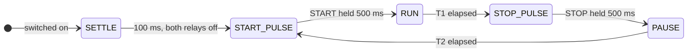

# CNC Chip Conveyor Timer

Interval timer for a CNC chip conveyor. It presses the conveyor's **START** and
**STOP** buttons for you, in a loop, so the coolant on the swarf drains back
into the machine instead of leaving with the chips.


<!-- photo of the box on the machine: docs/photo.jpg -->

## Why

On many machines the chip conveyor is either always on or run by hand. Run
continuously it pulls the swarf out of the coolant too fast: the chips land in
the bin still wet, and a surprising amount of coolant goes with them.

Run the conveyor in short bursts instead, with a pause in between, and the
coolant drains off the belt while it stands still. Chips come out drier, the
coolant stays where it belongs.

This box does the pressing. One illuminated button, five run / pause programs,
one relay for START and one for STOP.

## How it works



| Mode | T1 — conveyor runs | T2 — conveyor rests |
|:---:|:---:|:---:|
| 1 | 15 s | 15 s |
| 2 | 30 s | 60 s |
| 3 | 45 s | 90 s |
| 4 | 60 s | 120 s |
| 5 | 60 s | 240 s |

The two buttons are never pressed at the same time. The rule is enforced in
the relay driver itself — pressing one lets go of the other first — and every
start of the cycle begins with 100 ms of neither button pressed.

Both relays rest with their coils off, so the operator's panel buttons work as
if the timer were not there. To press a button the timer energises a relay for
500 ms: START through a normally-open contact across the START button, STOP
through a normally-closed contact in series with the machine's STOP circuit.

After **4 hours** of continuous running the timer switches itself off and
sounds a 15 s alarm.

## Operating it

Everything is done with the one button. A command is a series of quick clicks;
the series ends when the button stays released for 0.7 s.

| Clicks | Action |
|:---:|---|
| 1 | Switch on in the stored mode / switch off |
| 2 | Mode 1 |
| 3 | Mode 2 |
| 4 | Mode 3 |
| 5 | Mode 4 |
| 6 | Mode 5 |

Selecting a mode stores it in flash and starts (or restarts) the cycle at once.
The stored mode survives a power cycle; the device always powers up switched
off.

**Sounds**

| Event | Buzzer |
|---|---|
| Power on | 2 s |
| Cycle started or restarted | 2 s |
| Switched off by the operator | 0.5 s |
| 4 h auto-off | 15 s |
| First power-on (blank settings) | SOS, once |
| Settings flash unusable | SOS at every power-on |

**Button lamp**

| State | Lamp |
|---|---|
| Off | dark |
| Running | *N* blinks, 3 s dark, *N* blinks… where *N* is the mode |
| Settings flash unusable, switched off | fast flicker |

**On-board LED (HL1)** mirrors the state for whoever has the lid open: lit
during start-up, a flash every 3 s when off, and a distinct pattern for each
phase of the cycle while running.

### When the settings flash fails

The mode is kept in a flash page that is rewritten only when the mode changes.
A power loss in the middle of a write leaves a damaged record; on the next
power-on the page is repaired automatically and the last good mode is kept. If
even that fails the timer keeps working with the mode held in RAM, and says so:
SOS instead of the power-on beep, and the button lamp flickers whenever the
device is off. It can still be switched on and off and used normally until the
board is repaired.

## Hardware

Board `PCB1_main_rev1`, 24 V supply.

| MCU pin | Signal | Circuit |
|---|---|---|
| PB0 | `BUTTON_IN` | 10 kΩ pull-up, button to GND through 1 kΩ — active low |
| PA6 | `BUTTON_LED_ON` | 1 kΩ → CPC1014N solid-state relay → 24 V → button lamp |
| PA5 | `START_RELAY` | 1 kΩ → CPC1014N → relay K1, NO contact across the machine's START button. Energised to press |
| PA7 | `STOP_RELAY` | 1 kΩ → CPC1014N → relay K2, NC contact in series with the machine's STOP circuit. Energised to press |
| PB3 | `BUZZER` | 1 kΩ → CPC1014N → MLT-9650 active buzzer |
| PB7 | `DEBUG_LED` | 1 kΩ → HL1 |

### Rev 1 errata

- The START and STOP relay outputs were swapped on the connector in the
  original rev 1 netlist. Fixed on 2026-09-09 by renaming the nets in the
  schematic; the firmware pin labels follow (PA5 = START, PA7 = STOP). Boards
  built from the earlier netlist need the firmware labels swapped back.
- The 1 kΩ resistors feeding the CPC1014N inputs give ≈ 2.1 mA against a
  guaranteed turn-on of 2 mA. Works, but marginal; 330–470 Ω next revision.
- HL1 gets ≈ 1.2 mA and is dim.

Design sources (Altium) are in [`hardware/`](hardware/). Ready to
use: [schematic and assembly PDF](docs/CNC_rev1_2026-08-26.pdf) and
[gerbers, drill and pick-and-place](docs/CNC_rev1_gerber_2026-08-26.zip) in
`docs/`.

## Firmware

STM32CubeMX generates the HAL project (`firmware/CNC_TIMER.ioc`); IAR
Embedded Workbench builds it (`firmware/EWARM/Project.eww`). Everything the device does lives in
the `Core/` sources; the CubeMX-generated files are only touched inside their
`USER CODE` sections.

A prebuilt image is kept in [`firmware/hex/`](firmware/hex/) — flash it over
SWD with STM32CubeProgrammer at `0x08000000` if you only want to run the board.

### Building

1. IAR Embedded Workbench for Arm 9.1 (any 9.x should do). STM32CubeMX is only
   needed if you change `CNC_TIMER.ioc`; the generated files are committed.
2. Open `firmware/EWARM/Project.eww`, build. The image lands in
   `firmware/EWARM/CNC_TIMER/Exe/CNC_TIMER.hex` (the output converter is on).
3. Flash over SWD. X2 has no NRST line, so the debugger cannot reset the
   board — power-cycle it instead.
4. The shipped `.hex` was built with compiler optimisation **switched off**.
   The project file carries CubeMX's default, High / Size; to reproduce the
   shipped image set Project → Options → C/C++ Compiler → Optimizations →
   Level: None before building.

| Module | Job |
|---|---|
| `button.c` | Debounce, click-series detector, deaf/listening gate |
| `relay.c` | The two relays, mutual exclusion, polarity |
| `cycle.c` | START / RUN / STOP / PAUSE state machine |
| `settings.c` | Mode in the last flash page, append-only log, repair, fault flag |
| `indicator.c` | Button lamp: blink bursts, flicker |
| `buzzer.c` | Beeps and the Morse SOS |
| `debug_led.c` | HL1 patterns |
| `app.c` | Power-on signature, OFF / RUN, click dispatch, 4 h clock, sounds |
| `main.c` | Wiring only |

The main loop never blocks. `Button_Tick()` runs from SysTick every 1 ms; every
other module is polled from the loop and works from `HAL_GetTick()`.

The settings page is the last 2 KB of flash (`0x0801F800`); the linker script
ends ROM one page early so no code can land there. Every module exposes a
`volatile` `g_*` structure for the IAR Live Watch window — counters, live
values, measured timings — so the board can be read without a printf.

## Repository layout

```
firmware/   STM32CubeMX project (CNC_TIMER.ioc), HAL drivers, IAR workspace in EWARM/
hardware/   Altium Designer sources of PCB1_main_rev1 (schematic, PCB, Draftsman assembly drawing)
docs/       schematic and assembly PDF, gerbers, operator's guide (A4), button label (150 x 20 mm)
```

For the operator: [one-page guide](docs/operator-guide-A4.pdf) and a
label to stick next to the button, [150 × 20 mm strip](docs/button-label-150x20.pdf)
or [50 × 150 mm vertical](docs/button-label-50x150.pdf) — all generated from the
`.html` files beside them; print at 100 %.

## Status

Testing. The firmware builds and runs on the rev 1 board: button, relay
cycle, mode selection and storage, indication and sounds all work. Long-run
behaviour (the 4 h auto-off, flash wear, the fault paths) is still being
exercised before the first release.

## License

MIT — see [`LICENSE`](LICENSE).
